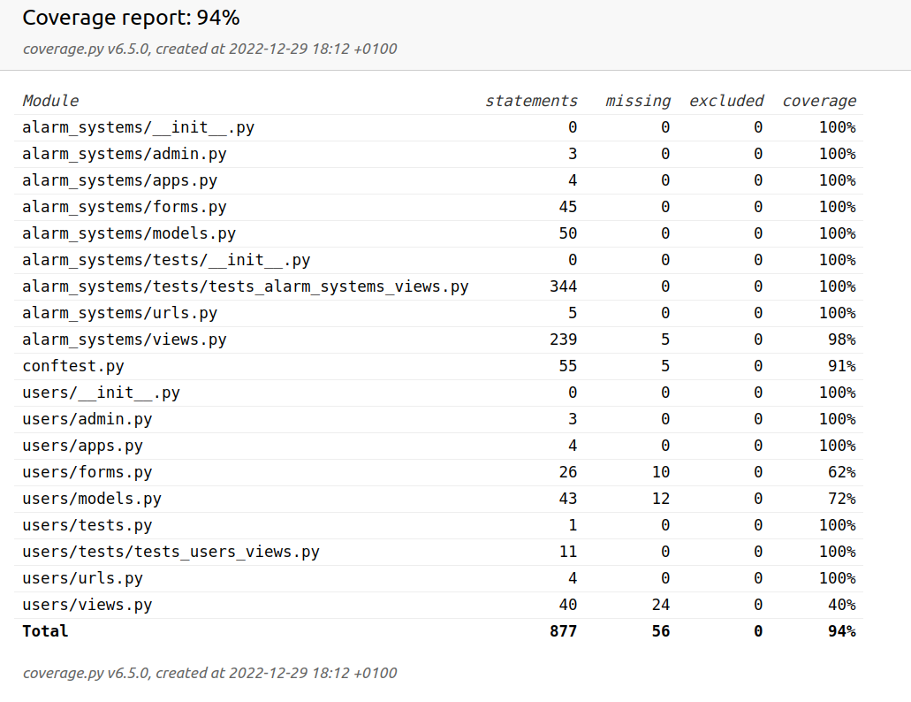

# ADE
An app created to record alarm systems owned by customers. Can also send an e-mail.
https://marcines.pythonanywhere.com/

## Features

1. Every app user can add/edit/delete customers.
2. User can add/edit/delete alarm system ( and its components ) to chosen customer. Alarm systems are: video survaillance or motion detecting alarms.
2. Alarm systems are linked to desired location. Eg. Video surveillance in home. Every customer can have multiple locations and alarm systems.
4. Possibility to send email to chosen customer.

### Installation
* Clone the repository 
```
$ git clone https://github.com/MarcinSerwinski/ADE.git
```
* Create virtual environment to install dependencies and activate it:
```
$ python -m venv venv
$ source venv/bin/activate
```
* Install the dependencies:
```
(venv)$ pip install -r requirements.txt
```

## Unit tests
